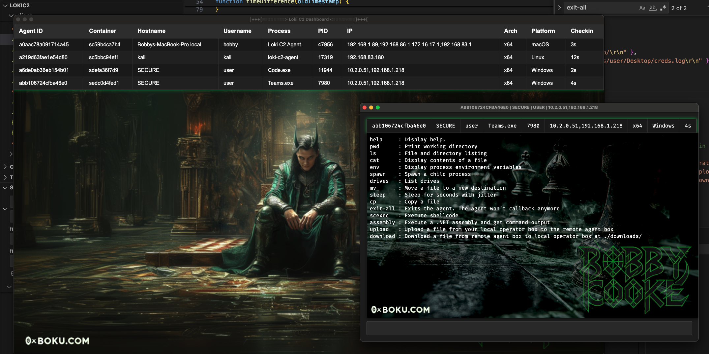

# 🧙‍♂️ Loki Command & Control
Loki is a stage-1 command and control (C2) framework written in Node.js, built to script-jack vulnerable Electron apps _[MITRE ATT&CK T1218.015](https://attack.mitre.org/techniques/T1218/015/)_. Developed for red team operations, Loki enables evasion of security software and bypasses application controls by exploiting trusted, signed Electron apps.

Script-jacking hijacks the execution flow of an Electron app by modifying JavaScript files loaded in at runtime with arbitrary Node.js code. This technique can be leveraged to:
- __Backdoor the Electron app__
- __Hollow out the Electron app__
- Chain execution to another process

_While several tools already address leveraging script-jacking to chain execution to another process, Loki is the first to enable backdooring and hollowing of signed Electron apps without invalidating their code signing signature._

For more details on how Loki works, checkout this blog post:  
- [Bypassing Windows Defender Application Control with Loki C2](https://www.ibm.com/think/x-force/bypassing-windows-defender-application-control-loki-c2)




## 🚀 Contributors

| Name                | Contributions                 |
|---------------------|-------------------------------|
| [Bobby Cooke](https://x.com/0xBoku)    | Creator & Maintainer |
| [Dylan Tran](https://x.com/d_tranman)  | Creator |
| [Ellis Springe](https://x.com/knavesec)| Alpha Tester |
| [Shawn Jones](https://x.com/anthemtotheego) | Assembly Execution Code | 
| [Simon Exley](https://www.linkedin.com/in/simon-exley-355816194/) | Video Creator |
| [Clinton Elves](https://www.linkedin.com/in/clinton-elves-180ba0148/) | Video Creator |
| [John Hammond](https://x.com/_JohnHammond) | Video Creator |

## Videos
Check out this video by [John Hammond](https://x.com/_JohnHammond) on backdooring Cursor AI with Loki C2! 🎩       
- In the video he walks through discovering a new vulnerable Electron application, backdooring it with Loki C2, getting setup with the client GUI, and we even came up with two ways to keep the app running persistently in the background 🪄 -- Cursor runs normally from the end users perspective! 🥷      

[](https://www.youtube.com/watch?v=FYok3diZY78)

Check out this video by [Simon Exley & Clinton Elves](https://x.com/SimonExley25688) on getting up and running with Loki C2! 🧙‍♂️  

[](https://www.youtube.com/watch?v=c8DgrpwJWw0)

## Features & Details
- Azure Storage Blob C2 channel
  - SAS Token to protect C2 storage account
- AES encrypted C2 messages
- Proxy-aware agent
  - Uses Chromium renderer child processes for agent, shellcode execution, and assembly fork-n-run style execution -- inherits proxy-aware capabilities of Chromium.
- Teamserver-less
  - Unlike traditional C2's where agents send messages to a Teamserver, there is no Teamserver
  - The GUI client & agents both checkin to the same data-store
- Hidden exection -- runs in the background

### Commands
_All agent commands are written in native Node.JS and do not require additional dependencies or library load events. With the exception of the `scexec` and `assembly` commands which do a library load on `keytar.node` and `assembly.node`_
- All commands accept paths using `/`, `\` in paths will not work.

| Command     | Description                                                                |
|-------------|----------------------------------------------------------------------------|
| `help`      | Display help. Usage: `help` or `help scan`                                 |
| `pwd`       | Print working directory                                                    |
| `ls`        | File and directory listing                                                 |
| `cat`       | Display contents of a file                                                 |
| `env`       | Display process environment variables                                      |
| `spawn`     | Spawn a child process                                                      |
| `drives`    | List drives                                                                |
| `mv`        | Move a file to a new destination                                           |
| `sleep`     | Sleep for seconds with jitter                                              |
| `cp`        | Copy a source file to a destination                                        |
| `exit-all`  | Exits the agent, agent won't callback anymore                              |
| `load`      | Load a node PE file from disk into the process                             |
| `scexec`    | Execute shellcode                                                          |
| `assembly`  | Execute a .NET assembly and get command output                             |
| `upload`    | Upload a file from your local operator box to the remote agent box         |
| `download`  | Download a file from remote agent box to local operator box                |
| `scan`      | Perform TCP network scan across CIDR range with selected ports             |
| `dns`       | DNS lookup. Leverages systems DNS configuration                            |
| `set`       | Set the Node load paths for assembly node and scexec nodes                 |  

#### `Set` - Loading Nodes from Application Control Exclusion Paths
- If there are application control rules preventing library loads for the node files you can use the `set` command to change the load paths for `assembly.node` and `scexec.node`. 
- By using `ls`, `cat`, `cp` and `mv` you may be able to enumerate the application control rules to discover a writable directory that is an exclusion. 
- With this you can put the node files in the exclusion directory and use the `set` command to change their load path to the exclusion directory to bypass the application control. 
- For more details on this attack vector see the [CRTO2](https://training.zeropointsecurity.co.uk/courses/red-team-ops-ii) course by [Daniel Duggan (@_RastaMouse)](https://x.com/_RastaMouse) 

```
[04-04-2025 8:50AM MST] advsim$ help set
Set the Node load paths for assembly node and scexec nodes
	set scexec_path C:/Users/user/AppData/ExcludedApp/scexec.node
	set assembly_path C:/Users/user/AppData/ExcludedApp/assembly.node
[04-04-2025 8:51AM MST] advsim$ set scexec_path C:/Users/user/AppData/ExcludedApp/scexec.node
SCEXEC Node Load Path Set to : C:/Users/user/AppData/ExcludedApp/scexec.node
```

### Agent Features
[For more information on Agent features click here](docs/features/agent.md)

### Client Features
[For more information on Client features click here](docs/features/client.md)

## 🧙‍♂️ Deploy Illusions 
First you need to identify a vulnerable Electron application which does not do ASAR security integrity checks such as `Microsoft Teams`. Newer applications may have integrity checks preventing backdooring. Older versions of the target app are more likely to be vulnerable. 

- [Guide for Discovering Vulnerable Electron Apps](docs/vulnhunt/electronapps.md)

| Vulnerable | App Name                                              | EXE Name            | Version         | Discovery Credit                                                             | 
|------------|-------------------------------------------------------|---------------------|-----------------|------------------------------------------------------------------------------|
| ✅         | Microsoft Teams                                       | `Teams.exe`         | `1.7.00.13456`  | Andrew Kisliakov & [mr.d0x](https://twitter.com/@mrd0x)                      |
| ✅         | Cursor                                                | `cursor.exe`        | `0.48.7.0`      | [John Hammond](https://x.com/_JohnHammond)                                   | 
| ✅         | VS Code                                               | `code.exe`          |                 | [chompie1337](https://x.com/chompie1337) & [knavesec](https://x.com/knavesec)|
| ✅         | Github Desktop                                        | `GithubDesktop.exe` | `3.4.6.0`       | [d_tranman](https://x.com/d_tranman) & [0xBoku](https://x.com/0xBoku)        |
| ✅         | [Postman](https://www.postman.com/downloads/)         | `Postman.exe`       |                 | [clod81](https://github.com/clod81)                                          |
| ✅         | [Obsidian](https://obsidian.md/download)              | `Obsidian.exe`      |                 | [clod81](https://github.com/clod81)                                          |
| ✅         | Joplin                                                | `Joplin.exe`        |                 | [0xAnom4ly](https://github.com/0xAnom4ly)                                    |
| ✅         | Discord                                               | `Discord.exe`       |                 | [clod81](https://github.com/clod81)                                          |
| ✅         | [Windsurf](https://windsurf.com/download)             | `Windsurf.exe`      |                 | [nero22k](https://github.com/Nero22k)                                        |
| ✅         | [Figma](https://www.figma.com/downloads/)             | `Figma.exe`      |                 | [WaterBucket](https://x.com/DharaniSanjaiy)
| ✅         | [RingCentral](https://www.ringcentral.com/download)   | `RingCentral.exe`   |                 | [4y45u45c4](https://x.com/4y45u45c4)                                         |
| ✅         | [阿里云盘](https://www.alipan.com/)                    | `aDrive`            | `6.8.6`  | [Adnnlnistrator](https://github.com/Adnnlnistrator)|
| ✅         | [azuredatastudio](https://azure.microsoft.com/zh-cn/products/data-studio/)                     | `azuredatastudio.exe`            | `1.51.1`  | [Adnnlnistrator](https://github.com/Adnnlnistrator)|
| ✅         | [atom](https://atom-editor.cc/)                    | `atom.exe`            | `1.60.0`  | [Adnnlnistrator](https://github.com/Adnnlnistrator)|
| ✅         | [Bruno](https://www.usebruno.com)                    | `Bruno.exe`            | `2.1.0`  | Tyler Schultz |
| ✅         | [KeeWeb](https://keeweb.info/)                        | `KeeWeb.exe`        |                 | [j0hnZ3RA](https://github.com/j0hnZ3RA)                                      |
| ✅         | [Wordpress](https://apps.wordpress.com/pt-br/d/windows/)| `Wordpress.com.exe`|                | [j0hnZ3RA](https://github.com/j0hnZ3RA)                                      |
| ✅         | [Arduino IDE](https://www.arduino.cc/en/software/)    | `Arduino IDE.exe`   |                 | [j0hnZ3RA](https://github.com/j0hnZ3RA)                                      |
| ✅         | [QRLWallet](https://www.theqrl.org/)                    | `QRLWallet.exe`            | `1.8.1`  | [OnlySmrtSumX](https://www.linkedin.com/in/onlysmrtsumx/) & [tideboss](https://www.linkedin.com/in/kursad-dev/)|
| ✅         | [DevHub](https://devhubapp.com/)                    | `DevHub.exe`            | `0.102.0`  | [ab4y98](https://github.com/Ab4y98)|
| ✅         | [Asana](https://asana.com/)                           | `Asana.exe`           | `2.3.0`       | [syro](https://github.com/0xsyr0)                                            |
| ✅         | [Insomnia](https://insomnia.rest/)                    | `insomnia-11.0.2.exe` | `11.0.2`      | [syro](https://github.com/0xsyr0)                                            |
| ✅         | [Ferdium](https://ferdium.org/)                    | `Ferdium.exe` | `7.0.1`      | [pir4cy](https://github.com/pir4cy)                                            |
| ❌         | 1Password                                             | `1Password.exe`     |                 |                                                                              |
| ❌         | Signal                                                | `Signal.exe`        |                 |                                                                              |
| ❌         | Slack                                                 | `slack.exe`         |                 |                                                                              |
| ❌         | Notion                                                | `Notion.exe`        |                 |                                                                              |


### Simple Instructions
_You don't need to compile the agent when backdooring Electron apps. Just replace the contents of `{ELECTRONAPP}/resources/app/` with the Loki agent files._

### Detailed Instructions
#### Step 1 : Create Azure Storage Blob Account and get SAS Token
- [Create Azure Storage Account via Azure Portal](./docs/azure/create-storage-account-portal.md)
- [Create Azure Storage Account via Azure CLI](./docs/azure/create-storage-account-sas-azurecli.md)
#### Step 2 : Create Obfuscated Loki Payload
- Clone this repo and `cd` into it
- Install Node.JS
- Install `javascript-obfuscator` module
```
npm install --save-dev javascript-obfuscator
```
- Run `obfuscateAgent.js` script to create a Loki payload with your Storage Account info
```
bobby$ node obfuscateAgent.js 
[+] Provide Azure storage account information:
        - Enter Storage Account  : 7f7584ty218ba5dba778.blob.core.windows.net
        - Enter SAS Token        : se=2025-05-28T23%3A14%3A48Z&sp=rwdlac&spr=https&sv=2022-11-02&ss=b&srt=sco&sig=5MXQzJ6FDZK8yYiBSgJ6FDZKgQzJMXBSgg6qE4ydrJ6FDZKSgg%3D

[+] Configuration:
        - Storage Account : 7f7584ty218ba5dba778.blob.core.windows.net
        - SAS Token       : se=2025-05-28T23%3A14%3A48Z&sp=rwdlac&spr=https&sv=2022-11-02&ss=b&srt=sco&sig=5MXQzJ6FDZK8yYiBSgJ6FDZKgQzJMXBSgg6qE4ydrJ6FDZKSgg%3D
        - Meta Container  : mllyi2zjmafjm

[+] Updated /Users/bobby/apr2/LokiC2/config.js with storage configuration. 
 - Enter into the Loki Client UI
        Loki Client > Configuration

[+] Modifying PE binaries to have new hashes...
        - Payload assembly.node hash : e9d126407264821d3c2d324da0e2d1bc13cbc53e7c56340fe12b07f69b707f02
        - Payload keytar.node   hash : 292c14ffebd6cae3df99d9fbee525e29a5a704f076b82207eb3e650de45b075d

[+] Payload ready!
         - Obfuscated payload in the ./app directory
```
#### Step 3 : Backdoor Electron Application
- Your obfuscated Loki payload is output to `./app/`
- Change directory to the `{ELECTRONAPP}/resources/`  
- Delete everything
- Copy the Loki `./app/` folder to `{ELECTRONAPP}/resources/app/`
- Click the Electron PE file and make sure Loki works

#### Step 4 : Configure Loki Client
- Launch the Loki GUI client
- From the menubar click `Loki Client > Configuration` to open the Settings window
- Enter in your Storage Account details and click `Save`
  
  
- The agent should now render in the dashboard
- Click the agent from the dashboard table to open the agent window
- Test to ensure Loki works properly


## Backdooring Electron Apps and Keeping the real Application Working as Normal
The most straightforward way to use Loki is to replace the files in `{ELECTRONAPP}/resources/app/` with the Loki files. This hollows out the app, meaning the app won't function normally -- Loki replaced its functionality.  

If you really want to keep the Electron application running and have it also deploy Loki in the background all hope is not lost! [John Hammond](https://x.com/_JohnHammond) and I figured out a way to keep the real Electron application running. We've added the file you will need to `/loki/proxyapp/init.js` in this repo.

It is currently setup to work for Cursor, discovered to be vulnerable by [John Hammond](https://x.com/_JohnHammond). 

For doing this you will need to:
- Download the Cursor app
- Paste all Loki files except `package.json` to `cursor/resources/app/`
  - Don't replace the real `package.json`
- Copy `/loki/proxyapp/init.js` to `cursor/resources/app/`
- Modify contents of `cursor/resources/app/package.json` to:
  - set `"main":"init.js",`
  - delete `"type":"module",`
  - delete `"private":true,`

### How this works
- With these changes `Cursor.exe` will load in `init.js` on click / execution
- `init.js` reads in `package.json`
- `init.js` changes `"main":"init.js",` -> `"main":"main.js",`
  - `main.js` is Loki
- `init.js` spawns and disowns a new `Cursor.exe` which points to Loki
- __Loki is spawned in the background__
- `init.js` reads in `package.json` again
- `init.js` changes `"main":"main.js",` -> `"main":"./out/main.js",`
  - `./out/main.js"` is the real Cursor application
- `init.js` spawns and disowns a new `Cursor.exe` which points to the real Cursor
- __Real Cursor app is spawned, visible and operates as normal__
- When Cursor is exited by the user:
  - `init.js` catches the exit
  - `init.js` reads in `package.json` for a third time
  - `init.js` changes `"main":"./out/main.js",` -> `"main":"init.js",`

This way the app is persistently backdoored and operates as normal. If the cursor app is exited loki will continue to run in the background.

### Future
I'll make a script to automate this in the future.

## Opsec Recommendations
- [Opsec Recommendations](docs/opsec/recommendations.md)

## Compilation Guides
These are the compile instructions for building the agents & clients. The instructions cover multiple platforms, including Windows, Linux, and macOS. It is recommended to compile the client on the target platform and architecture.

### Client
- [Windows](./docs/compile/client/windows.md)
- [macOS](./docs/compile/client/macos.md)
- [Linux](./docs/compile/client/linux.md)

### Agents
**If you are backdooring an Electron application then you don't need to compile agents.**  

I do not recommend compiling the agent and using it for operations. Agent compile instructions are for development. 

- [Windows](./docs/compile/agent/windows.md)
- [Linux](./docs/compile/agent/linux.md)
- [macOS](./docs/compile/agent/macos.md)

## Detection Guidance
- Review the information provided by MITRE for more details, examples, and information about this TTP :
  -  [MITRE ATT&CK T1218.015: Electron Applications](https://attack.mitre.org/techniques/T1218/015/)
- Execution of an electron app from a abnormal directory such as `~/Downloads/Teams/Teams.exe`
- Electron apps beaconing to an Azure Storage Blob `*.blob.core.windows.net`
- SAS token usage in network traffic
- Electron apps spawning child processes such as `netstat.exe` or `whoami.exe`
- A directory with the name in the Loki `package.json` will be created in `~/AppData/Roaming/{NAME}` when the Loki JavaScript executes in the Electron process.
- This [LOLBAS Teams](https://lolbas-project.github.io/lolbas/OtherMSBinaries/Teams/) entry covers detections for Electron application backdooring. The detection information has been copied below.  
- IOC: `%LOCALAPPDATA%\Microsoft\Teams\current\app` directory created
- IOC: `%LOCALAPPDATA%\Microsoft\Teams\current\app.asar` file created/modified by non-Teams installer/updater
- [SIGMA rule](https://github.com/4y45u45c4/SIGMA/blob/main/loki_c2_channel_established_from_electron_app.yaml) to detect established Loki C2 from electron app
- [SIGMA rule](https://github.com/4y45u45c4/SIGMA/blob/main/hijack_of_electron_app_to_load_C2_framework.yaml) to detect hijacking of Electron's app folder (Teams, VS Code, RingCentral, Postman) to load C2 framework 


# References || Acknowledgements || Offensive Electron Research 
- [Dylan Tran (@d_tranman)](https://x.com/d_tranman)
  - Cocreator of the Loki agent. Created node modules for shellcode and assembly execution.  
- [Valentina Palmiotti (@chompie1337)](https://x.com/chompie1337), [Ellis Springe (@knavesec)](https://x.com/knavesec), and [Ruben Boonen](https://x.com/FuzzySec) for their previous internal work on backdooring Electron applications for persistence
- [Ruben Boonen](https://x.com/FuzzySec)
  - [ Wild West Hackin’ Fest talk Statikk Shiv: Leveraging Electron Applications for Post-Exploitation](https://www.youtube.com/watch?v=VXb6lwXhCAc)
- Andrew Kisliakov 
  - [Microsoft Teams and other Electron Apps as LOLbins](https://l--k.uk/2022/01/16/microsoft-teams-and-other-electron-apps-as-lolbins/)
- [Shawn Jones](https://x.com/anthemtotheego)
  - For Loki assembly execution Dylan ported Shawn’s public [InlineExecute-Assembly](https://github.com/anthemtotheego/InlineExecute-Assembly) code 
- [mr.d0x (@mrd0x)](https://twitter.com/@mrd0x) for their prior work about leveraging the Teams Electron application to execute arbitrary Node.JS code and publishing their findings to the LOLBAS project.
- Michael Taggart
  - [quASAR project, a tool designed for modifying Electron applications to enable command execution](https://github.com/mttaggart/quasar)
  - [Quasar: Compromising Electron Apps](https://taggart-tech.com/quasar-electron/)
- [Raphael Mudge](https://bsky.app/profile/raphaelmudge.bsky.social) for inspiring me to dive deep into red teaming and supporting the release of this tool
  - [The Security Conversation](https://aff-wg.org/)
- [Fletcher Davis](https://x.com/gymR4T)
  - [BSides : Abusing Electron Applications](https://github.com/gymR4T/presentations/blob/main/BSidesNOVA2022_ElectronApplicationAbuse.pdf)
- [Pavel Tsakalidis](https://x.com/sadreck)
  - [BEEMKA - Electron Exploitation Toolkit](https://github.com/ctxis/beemka)


## License
This project is licensed under the Business Source License 1.1. Non-commercial use is permitted under the terms of the license. Commercial use requires the author's explicit permission. On April 3, 2030, this license will convert to Apache 2.0. See [LICENSE](./LICENSE) for full details.

