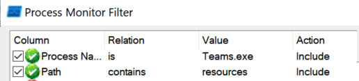
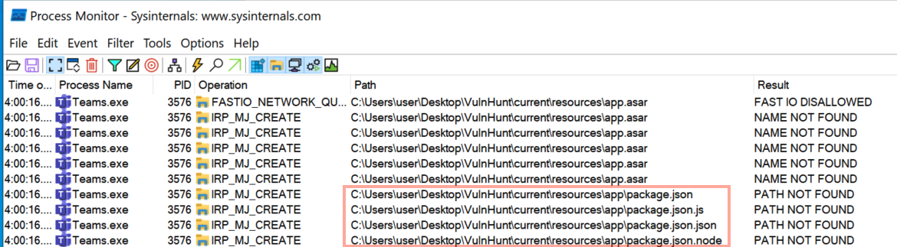

# Guide for Discovering Vulnerable Electron Applications
- Download an Electron app. In this example I will be using Teams.
- Find the app root folder, it will look something like this:
```
C:\Users\user\AppData\Local\Microsoft\Teams\current\
│   chrome_100_percent.pak
│   chrome_200_percent.pak
│   ffmpeg.dll
│   snapshot_blob.bin
│   Squirrel.exe
│   Teams.exe
└───resources
...
```
- In this case the root electron app directory is `C:\Users\user\AppData\Local\Microsoft\Teams\current\`
- Copy `\current\` to somewhere like your Desktop at `C:\Users\user\Desktop\VulnHunt\current\`
- Delete the contents of `\current\resources\*`
- Now open up ProcMon and add these filters:
  - Process Name is `Teams.exe`
  - Path contains `C:\Users\user\Desktop\VulnHunt\current\resources\`
  
- Then in Procmon start capturing the events
- We can see in the output that the Electron app first looks for the `app.asar`.
- If that failed then it looks for the unpacked application at `\current\resources\app\packages.json`
  - If this happens then the Electron app is most likely vulnerable to Script Jacking.
  - To confirm copy the Loki Agent code in `/LokiC2/agent/*` to the `current\resources\app\` directory and click `Teams.exe` again.
  

